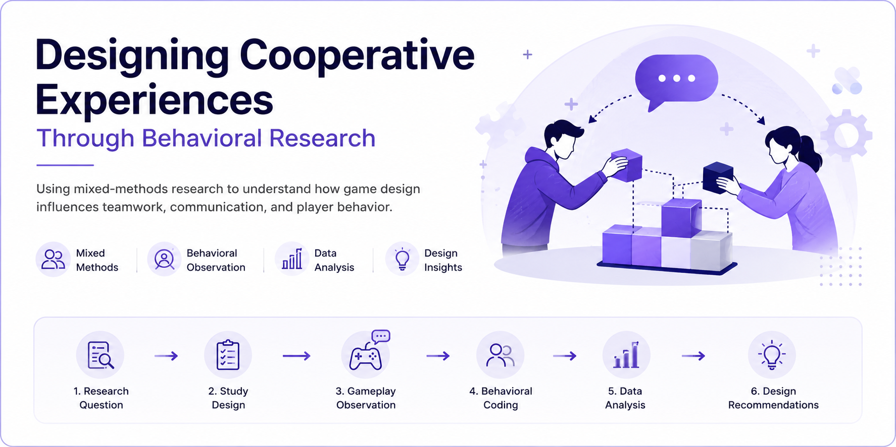

  

# Designing Cooperative Experiences Through Behavioral Research

> **Using mixed-methods research to understand how game design influences teamwork, communication, and player behavior.**

---

## 📄 Published Research

This case study is adapted from a peer-reviewed research publication completed during my graduate studies. It has been rewritten for a product research audience to highlight the research process, behavioral insights, and product design implications.

### Original Publication

**Power Dependency in Cooperative Games**

DOI: https://doi.org/10.31235/osf.io/wdy9h_v1

---

# Project Snapshot

| Category | Details |
|----------|---------|
| **Role** | Researcher |
| **Project Type** | Published Research |
| **Research Methods** | Mixed Methods, Behavioral Observation, Surveys |
| **Duration** | Graduate Capstone Research |
| **Tools** | Unity, Tableau, Google Sheets, Surveys |

---

# Executive Summary

Multiplayer experiences depend on more than game mechanics. They depend on how people communicate, collaborate, and adapt while working toward a shared goal.

For this published research project, our team investigated how different levels of player dependency influenced cooperation in a two-player puzzle game. By combining behavioral observation, surveys, gameplay analysis, and data visualization, we explored how players responded to different collaborative challenges and how those behaviors could inform future game design.

The findings demonstrated that intentional dependency between players can strengthen communication, encourage teamwork, and create more meaningful cooperative experiences. Although conducted in the context of games, the research principles extend to collaborative digital products where trust, communication, and shared decision-making are essential.

---

# The Product Challenge

Many cooperative games encourage players to work together, but few studies examine how specific game mechanics influence communication, trust, and collaborative behavior.

Without behavioral evidence, designers often rely on intuition when creating cooperative systems. This can lead to experiences that unintentionally reduce teamwork or create unnecessary frustration.

This research explored how intentionally designed player dependency influences cooperative behavior and how those findings can support more informed design decisions.

---

# Why This Matters

Understanding cooperative behavior extends beyond games.

Many digital products depend on people working together, whether they are using workplace software, educational platforms, multiplayer games, or AI-assisted tools. Designing successful collaborative experiences requires understanding how users communicate, adapt, solve problems, and build trust.

Whether designing multiplayer games, collaborative software, or AI-assisted experiences, understanding how people communicate and solve problems together allows teams to design products that feel more intuitive, engaging, and trustworthy.

---

# Objectives

This research focused on four primary objectives.

- Understand how different levels of player dependency influence cooperative behavior.
- Observe communication patterns during collaborative gameplay.
- Identify behaviors associated with successful teamwork.
- Translate research findings into practical design recommendations.

---

# My Contribution

As part of a multidisciplinary research team, I contributed throughout the research lifecycle, from study design to data analysis and final publication.

My responsibilities included:

- Designing research materials and participant surveys.
- Conducting gameplay observations and behavioral analysis.
- Organizing and cleaning research data.
- Creating visualizations to identify behavioral trends.
- Synthesizing qualitative and quantitative findings.
- Co-authoring the final publication and research presentation.

---

# Research Approach

To better understand cooperative player behavior, we combined several complementary research methods.

Our approach included:

- Literature review
- Experimental study design
- Participant recruitment
- Gameplay observation
- Behavioral coding
- Survey analysis
- Quantitative data analysis
- Data visualization
- Research synthesis

The project combined qualitative and quantitative methods to better understand both player behavior and the underlying reasons behind those behaviors.

Rather than relying on a single method, we combined multiple sources of evidence to better understand how players communicated, collaborated, and adapted throughout the experience.

---

# Key Insights

## 1. Shared dependency encourages communication

Players communicated more frequently when progress depended on both individuals working together.

## 2. Players naturally establish leadership roles when collaboration becomes necessary

Players often adopted leadership roles without explicit instruction, helping teammates coordinate and solve challenges together.

## 3. Shared understanding gradually replaces explicit communication

As players became more familiar with the mechanics, communication shifted from explicit instruction to shared understanding and efficient coordination.

## 4. Well-designed challenges encourage cooperation rather than frustration

Difficult moments often encouraged players to communicate more effectively, adapt their strategies, and support one another instead of becoming disengaged.

---

# Design Recommendations

Based on the research findings, several opportunities consistently emerged for designing stronger cooperative experiences.

## Design meaningful collaboration

Create mechanics where teamwork feels valuable rather than mandatory.

## Encourage flexible roles

Allow responsibilities to shift naturally so players remain engaged throughout the experience.

## Support communication through design

Design interactions that naturally encourage discussion instead of forcing players to communicate.

## Observe behavior, not only outcomes

Success metrics alone cannot explain player experiences. Observing behavior provides deeper insight into why certain interactions succeed.

---

# Product Applications

Although this research focused on cooperative games, the findings extend to many collaborative digital experiences.

The behavioral principles explored in this project can inform:

- Multiplayer and live-service games
- AI-assisted collaboration tools
- Educational technology
- Team productivity platforms
- Social and community-driven products

Understanding how people communicate, share responsibility, and adapt to changing situations helps teams design experiences that encourage collaboration rather than simply supporting it.

---

# Reflection

## What I Learned

This project fundamentally shaped how I think about user behavior.

Rather than evaluating experiences only through outcomes or performance metrics, I learned to observe how people communicate, negotiate, adapt, and solve problems together.

Those lessons continue to influence how I approach product research today. Whether evaluating AI products, consumer experiences, or digital platforms, I focus on understanding the behaviors that shape user experiences and using those insights to support better product decisions.

---

---

## Related Links

📄 Original Publication

https://doi.org/10.31235/osf.io/wdy9h_v1

🎮 Gambit's Gauntlet

https://shantanusgames.itch.io/gambits-gauntlet

🌐 Portfolio

https://shantanugupta.framer.ai

💼 LinkedIn

https://linkedin.com/in/shantanugupta99
